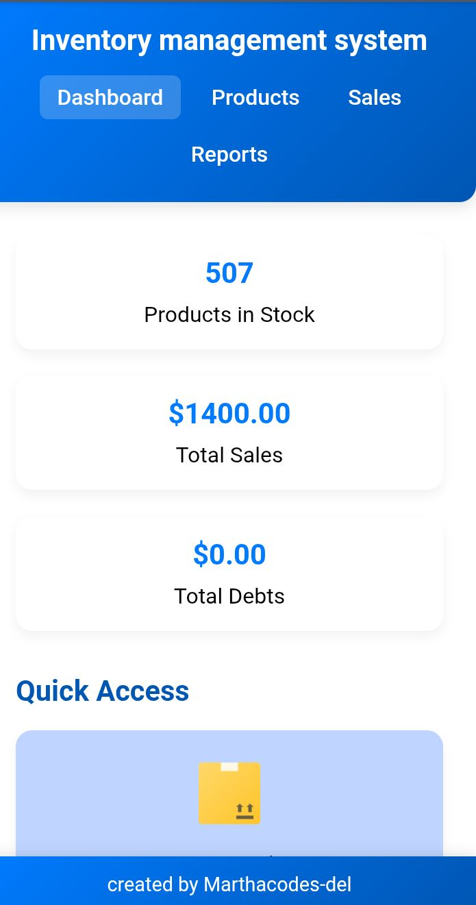
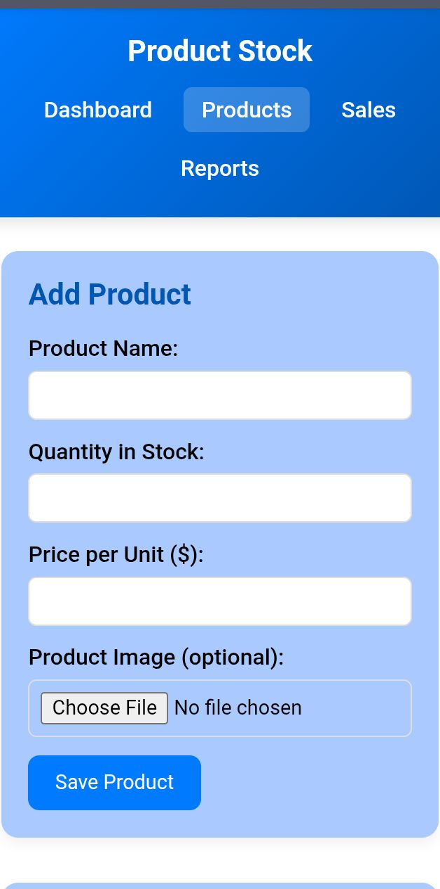
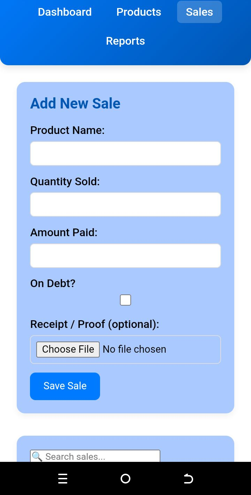
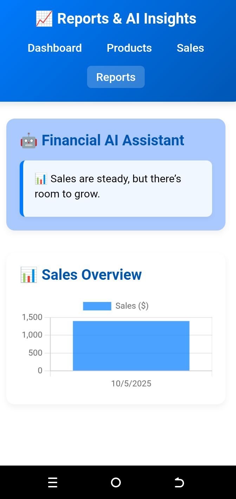

#  Inventory Management System

A full-featured Inventory Management System built with HTML, CSS, and JavaScript, using LocalStorage for data persistence. This system allows businesses to manage products, record sales, track debts, and generate reports with AI-powered insights.

##  Features

### Dashboard
- Quick stats for products in stock, total sales, and debts
- Clean, responsive layout with gradient blue theme
- Quick access links to Products, Sales, and Reports pages

### Products Management
- Add, edit, delete products
- Upload product images (auto-compressed for performance)
- Real-time search through product list

### Sales Management
- Record sales with **paid or on debt** status
- Upload receipt images
- **CRUD functionality** for all sales
- Real-time search

### Reports & AI Insights
- Automatic financial insights based on sales and stock
- Low stock alerts
- Advice on managing debts
- Visual chart using Chart.js to compare sales

### Responsive Design
- Fully responsive and mobile-friendly
- Minimal, modern layout with gradient blue and white theme

## Tech Stack
- Frontend: HTML, CSS, JavaScript  
- Data Storage: LocalStorage  
- Charts & Visualization:Chart.js
### Screenshots

#### Dashboard

#### Products Page

#### Sales Page

#### Reports Page

#### Live demo
-for a live demo click the link below 
https://marthacodes-del.github.io/Inventory-management-system-/
